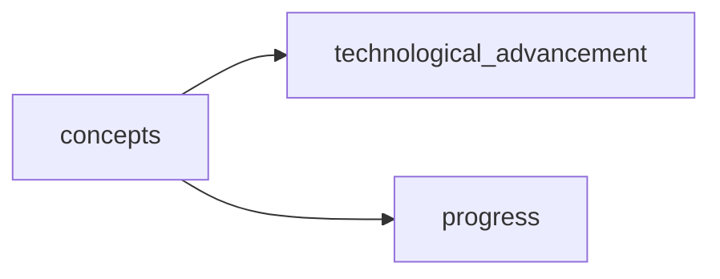

## concepts
1. Radical technological advancement and innovation as a means of accelerating societal progress and transformation.

2. Embracing and actively engaging with the consequences of accelerating changes, rather than resisting or attempting to slow them down.

3. A rejection of traditional leftist ideologies and a focus on harnessing capitalist structures for the purpose of creating radical change.

- [[technological_advancement]]
- [[progress]]

