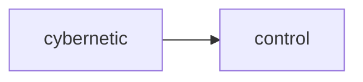

## control
Control refers to the ability to manipulate and regulate a system or process in order to achieve a desired outcome or maintain stability. It involves monitoring and adjusting inputs, outputs, and feedback loops to maintain a desired state.

