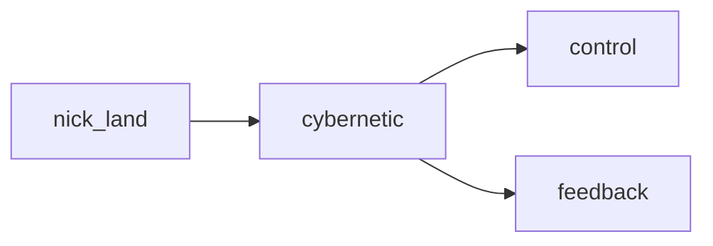

## cybernetic
Cybernetic refers to the intersection of technology, biology, and the human mind, often with a focus on the integration of artificial intelligence and human enhancement. It encompasses the study and use of systems and networks to enhance and control human functions and behaviors.

- [[control]]
- [[feedback]]

