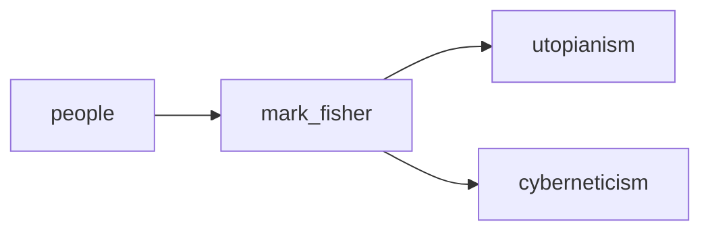

## mark_fisher
Mark Fisher was a British writer, cultural theorist, and music critic known for his influential works on capitalism, popular culture, and mental health. He was considered a leading voice in contemporary cultural criticism before his untimely death in 2017.

- [[utopianism]]
- [[cyberneticism]]

