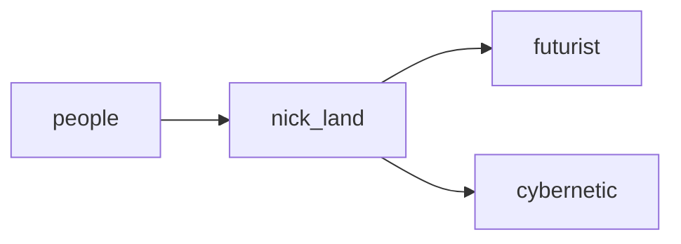

## nick_land
Nick Land is a British philosopher and writer known for his controversial ideas on accelerationism and the intersection of technology and philosophy.

- [[futurist]]
- [[cybernetic]]

```mermaid
flowchart LR
    people --> nick_land
nick_land --> futurist
    nick_land --> cybernetic
```
