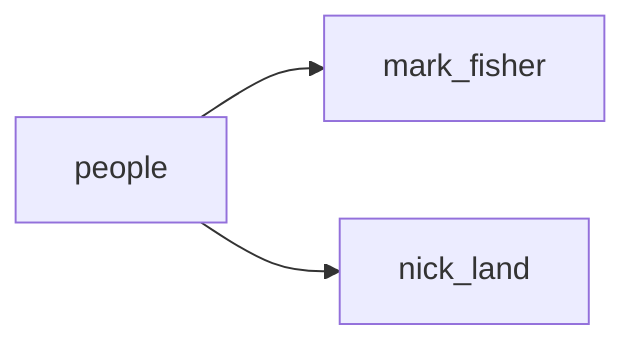

## people
1. Nick Land: A British philosopher and writer who is considered a key figure in the development of accelerationist thought.
2. Mark Fisher: A British cultural theorist and writer who was heavily influenced by accelerationism and wrote extensively on the subject.
3. Benjamin Noys: A British academic and writer who has critiqued and engaged with accelerationism in his work.

- [[mark_fisher]]
- [[nick_land]]

