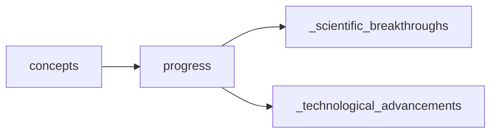

## progress
Progress refers to the advancement or improvement towards a specific goal or objective. It can be measured by the level of achievement or development compared to a previous state or benchmark.

- [[_scientific_breakthroughs]]
- [[_technological_advancements]]

