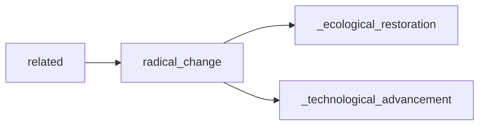

## radical_change
Radical change refers to a significant and fundamental shift in beliefs, attitudes, or systems, often resulting in a complete transformation of the current state. It is often seen as disruptive, challenging the status quo and pushing for new ways of thinking and operating.

- [[_ecological_restoration]]
- [[_technological_advancement]]

