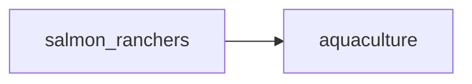

## aquaculture
Aquaculture is the practice of farming aquatic organisms such as fish, shellfish, and seaweed in controlled environments such as ponds, tanks, or cages. It is a major industry for salmon_ranchers, as it allows them to raise and harvest large quantities of salmon for commercial purposes.

