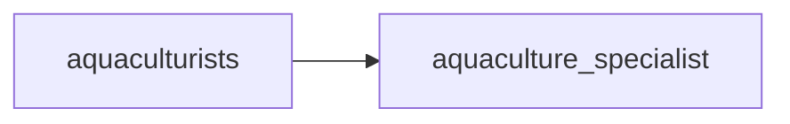

## aquaculture_specialist
An aquaculture specialist is a professional who specializes in the cultivation and management of aquatic plants and animals for commercial purposes, such as fish, shellfish, and seaweed. They have expertise in various aspects of aquaculture, including breeding, feeding, disease prevention, and water quality management.

