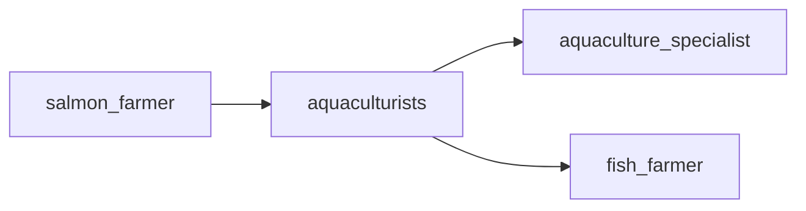

## aquaculturists
Aquaculturists are professionals who specialize in the cultivation and management of aquatic organisms, such as salmon, for commercial purposes. They are responsible for overseeing the entire process of raising salmon, from breeding and feeding to harvesting and ensuring the health and sustainability of the fish.

- [[aquaculture_specialist]]
- [[fish_farmer]]

