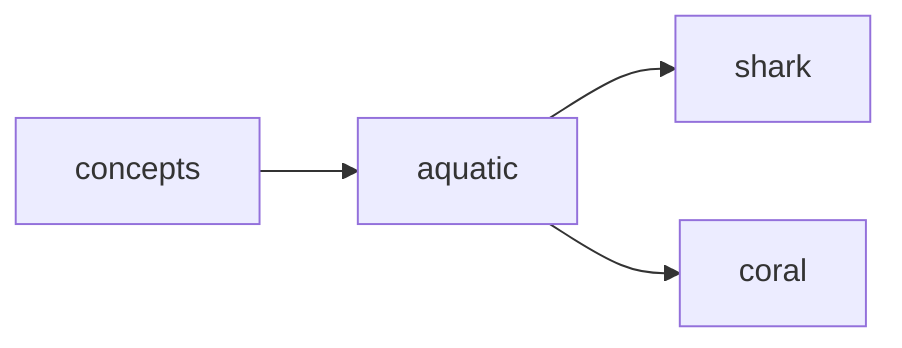

## aquatic
Aquatic refers to anything related to or living in water. It can also refer to environments, organisms, or activities that are associated with or take place in water.

- [[shark]]
- [[coral]]

