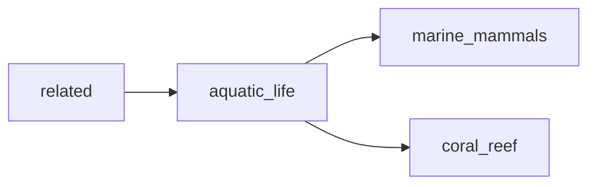

## aquatic_life
Aquatic life refers to all living organisms that inhabit bodies of water, including fish, invertebrates, plants, and microorganisms. They play important roles in maintaining the health and balance of aquatic ecosystems.

- [[marine_mammals]]
- [[coral_reef]]

