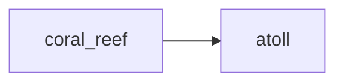

## atoll
An atoll is a ring-shaped coral reef or island that surrounds a lagoon. It is typically formed from the remnants of an extinct volcano and is found in warm, tropical waters.

```mermaid
flowchart LR
    coral_reef --> atoll

```
