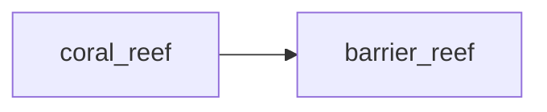

## barrier_reef
A barrier reef is a type of coral reef that runs parallel to the coastline and is separated from the shore by a lagoon. It acts as a natural barrier, protecting the coastline from strong waves and erosion.

