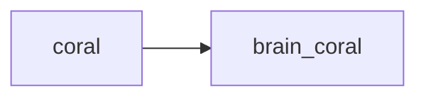

## brain_coral
Brain coral, also known as foliose coral, is a type of coral that has a convoluted, brain-like appearance due to its folded ridges and valleys. It is a slow-growing coral and can be found in a variety of colors and sizes.

