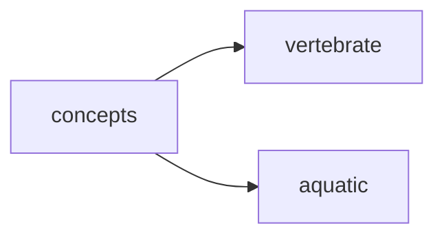

## concepts
1. Fish are aquatic vertebrates that have fins, gills, and a streamlined body for swimming in water.

2. They are cold-blooded animals that rely on external sources for body temperature regulation.

3. Fish have a diverse range of adaptations for survival in various aquatic environments, including different feeding strategies, body shapes, and reproductive methods.

- [[vertebrate]]
- [[aquatic]]

