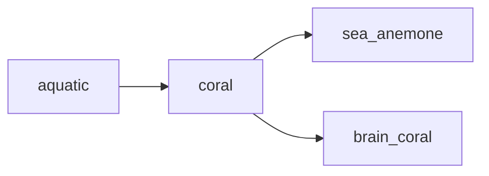

## coral
Coral is a marine invertebrate that forms large colonies of tiny animals called polyps, which secrete a hard exoskeleton made of calcium carbonate. These structures, known as coral reefs, provide essential habitats for a diverse array of marine life.

- [[sea_anemone]]
- [[brain_coral]]

