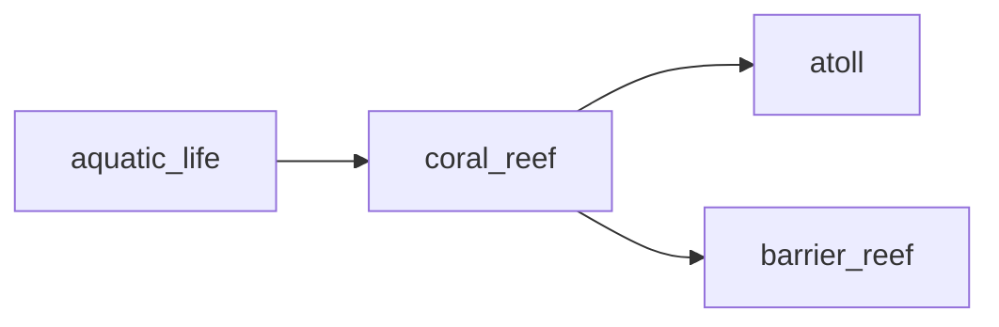

## coral_reef
Coral reef is a diverse ecosystem found in warm, shallow waters that is home to a variety of marine plants and animals, including colorful coral polyps, fish, and other invertebrates. They are vital for maintaining biodiversity and providing protection for coastlines.

- [[atoll]]
- [[barrier_reef]]

