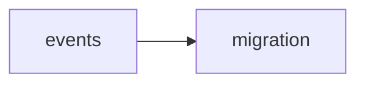

## events
1. "World Fisheries Day" is an annual event celebrated on November 21st to raise awareness about the importance of sustainable fishing practices and the conservation of fish populations. 

2. "The Great Pacific Garbage Patch" is a major event caused by ocean pollution, which has a significant impact on marine life, including fish. It is a large accumulation of plastic debris in the Pacific Ocean, affecting the ecosystem and threatening the survival of many fish species. 

3. "The collapse of the Atlantic cod fishery" in the late 20th century was a significant event that resulted in the decline of cod populations due to overfishing and mismanagement, leading to the loss of a major commercial and food source for many communities.

- [[migration]]

