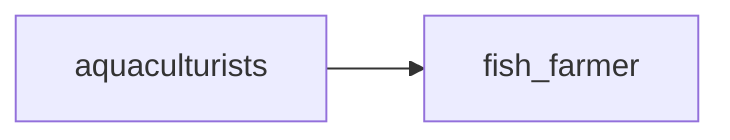

## fish_farmer
A fish farmer is someone who cultivates fish for commercial purposes, typically in a controlled environment such as a pond or tank. They are responsible for the care and management of the fish, as well as the overall production and sale of their products.

