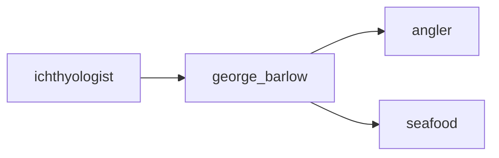

## george_barlow
George Barlow (1847-1913) was an American ichthyologist known for his research on the classification and evolution of fish. He was a curator at the Museum of Comparative Zoology at Harvard University and published numerous papers and books on fish taxonomy.

- [[angler]]
- [[seafood]]

