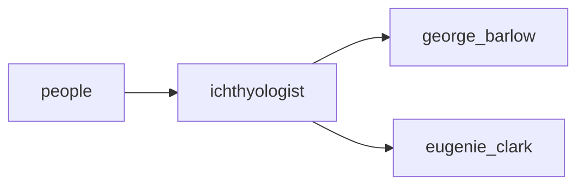

## ichthyologist
An ichthyologist is a scientist who studies fish, including their behavior, anatomy, and evolution. They may also specialize in specific types of fish or aquatic ecosystems.

- [[george_barlow]]
- [[eugenie_clark]]

