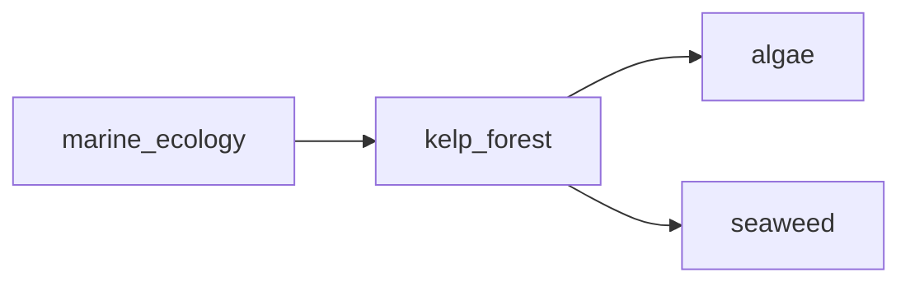

## kelp_forest
Kelp forests are underwater ecosystems dominated by large brown algae called kelp, which provide important habitat and food sources for a variety of marine animals. These forests are typically found in cold, nutrient-rich waters and are considered one of the most productive and diverse marine habitats.

- [[algae]]
- [[seaweed]]

