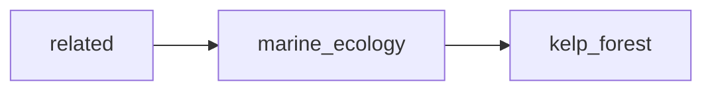

## marine_ecology
Marine ecology is the study of how marine organisms interact with each other and their environment, including the physical, chemical, and biological factors that influence their distribution, abundance, and behavior in the ocean.

- [[kelp_forest]]

