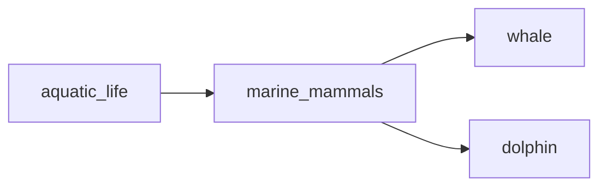

## marine_mammals
Marine mammals are a diverse group of animals that have adapted to life in the ocean, including whales, dolphins, seals, and sea lions. They are warm-blooded, breathe air, and give birth to live young.

- [[whale]]
- [[dolphin]]

