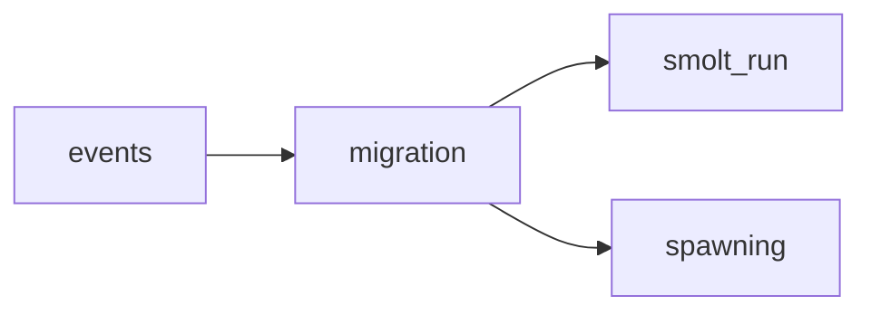

## migration
Migration refers to the movement of individuals or groups of people from one place to another, often motivated by economic, social, or political factors. It can occur within a country or across borders, and can have both positive and negative impacts on the individuals and societies involved.

- [[smolt_run]]
- [[spawning]]

