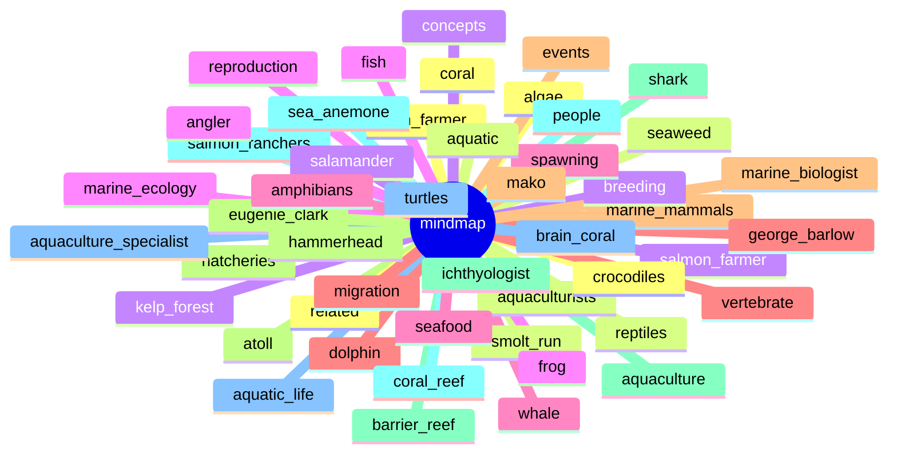

## fish 

 

```mermaid

mindmap
  root((mindmap))
    algae
    seaweed
    kelp_forest
    marine_ecology
    whale
    dolphin
    marine_mammals
    atoll
    barrier_reef
    coral_reef
    aquatic_life
    related
    smolt_run
    breeding
    reproduction
    spawning
    migration
    events
    hatcheries
    aquaculture
    salmon_ranchers
    aquaculture_specialist
    fish_farmer
    aquaculturists
    salmon_farmer
    angler
    seafood
    george_barlow
    marine_biologist
    eugenie_clark
    ichthyologist
    people
    turtles
    crocodiles
    reptiles
    salamander
    frog
    amphibians
    vertebrate
    mako
    hammerhead
    shark
    sea_anemone
    brain_coral
    coral
    aquatic
    concepts
    fish

```

