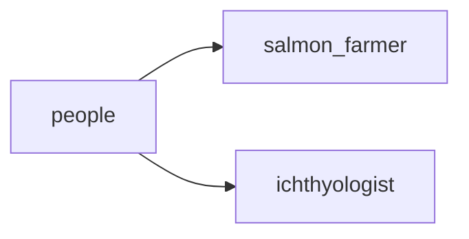

## people
1. Ichthyologist - a scientist who studies fish and their behavior, anatomy, and distribution.
2. Aquaculturist - a person who cultivates and harvests fish and other aquatic organisms for food or commercial purposes.
3. Fisherman - a person who catches fish for sport or for a living.

- [[salmon_farmer]]
- [[ichthyologist]]

