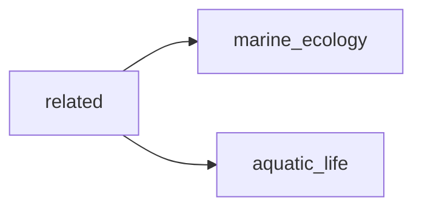

## related
1) Aquaculture: This is the practice of farming fish in controlled environments, often for commercial purposes. 
2) Biodiversity: Fish play a vital role in maintaining the health and diversity of aquatic ecosystems. 
3) Overfishing: This refers to the depletion of fish populations due to excessive and unsustainable harvesting practices.

- [[marine_ecology]]
- [[aquatic_life]]

