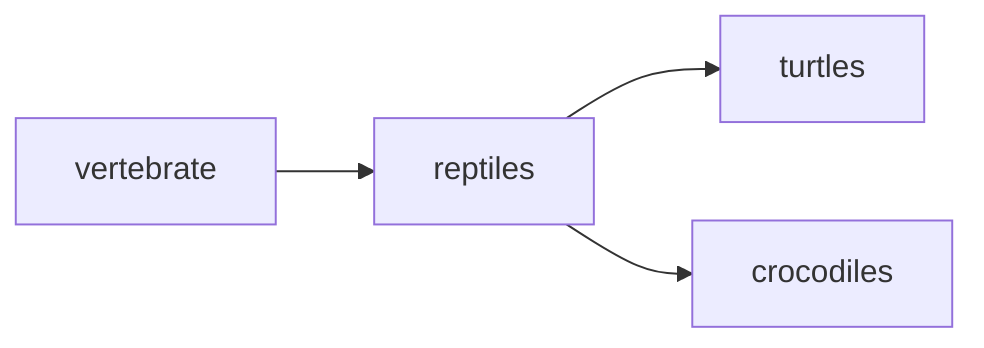

## reptiles
Reptiles are cold-blooded vertebrates that have scaly skin and lay eggs on land. They include animals such as snakes, lizards, turtles, and crocodiles.

- [[turtles]]
- [[crocodiles]]

```mermaid
flowchart LR
    vertebrate --> reptiles
reptiles --> turtles
    reptiles --> crocodiles
```
