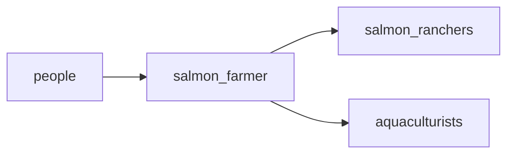

## salmon_farmer
Salmon farmers are individuals who cultivate and raise salmon in controlled environments, such as fish farms, for commercial purposes.

- [[salmon_ranchers]]
- [[aquaculturists]]

```mermaid
flowchart LR
    people --> salmon_farmer
salmon_farmer --> salmon_ranchers
    salmon_farmer --> aquaculturists
```
