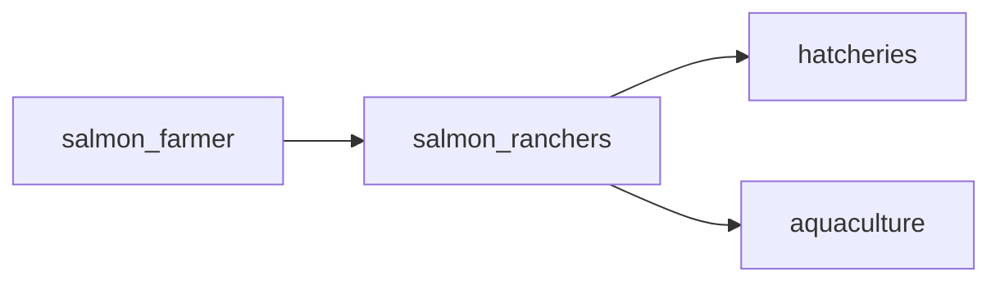

## salmon_ranchers
Salmon ranchers are individuals or companies that own and operate salmon ranches, which are large-scale facilities that cultivate and raise salmon for commercial purposes. They play a crucial role in the global salmon farming industry by providing a consistent supply of high-quality salmon to meet the demands of consumers.

- [[hatcheries]]
- [[aquaculture]]

