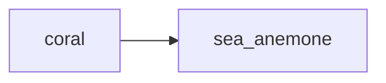

## sea_anemone
Sea anemones are marine animals that are closely related to corals and jellyfish. They have a cylindrical body with tentacles surrounding their mouth, which they use to catch prey and for protection.

