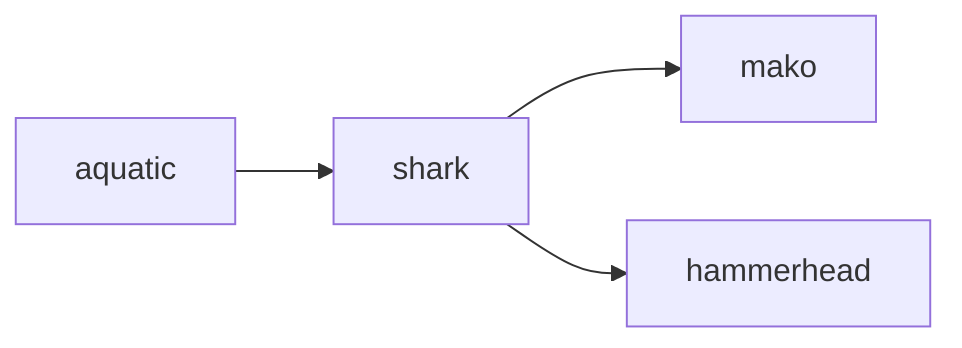

## shark
A shark is a large predatory fish with a streamlined body and sharp teeth, found in oceans and seas around the world. They are known for their powerful hunting abilities and have been feared by humans for centuries.

- [[mako]]
- [[hammerhead]]

