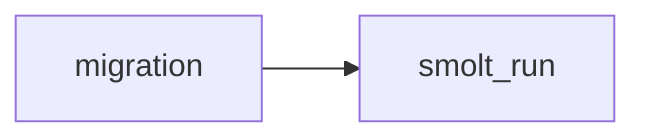

## smolt_run
Smolt_run is a process in the migration of fish where juvenile salmon migrate from freshwater to the ocean. It is an important stage in the salmon life cycle and helps to replenish their populations.

