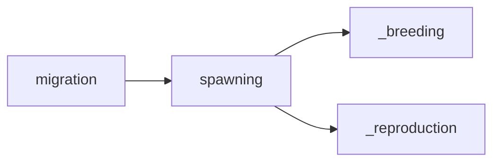

## spawning
Spawning refers to the act of fish or other aquatic animals laying their eggs in a specific location, usually in a large group, as part of their seasonal migration pattern.

- [[_breeding]]
- [[_reproduction]]

