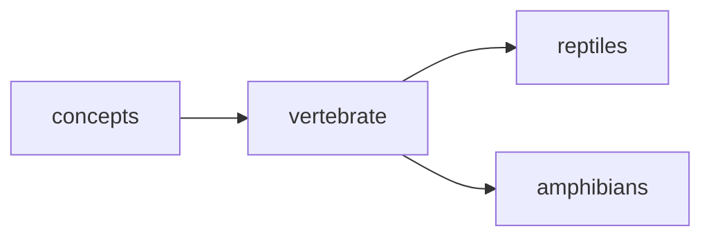

## vertebrate
Vertebrates are animals that have a backbone or spinal column, including mammals, birds, reptiles, amphibians, and fish. They also have a well-developed nervous system and a bilateral symmetry.

- [[reptiles]]
- [[amphibians]]

